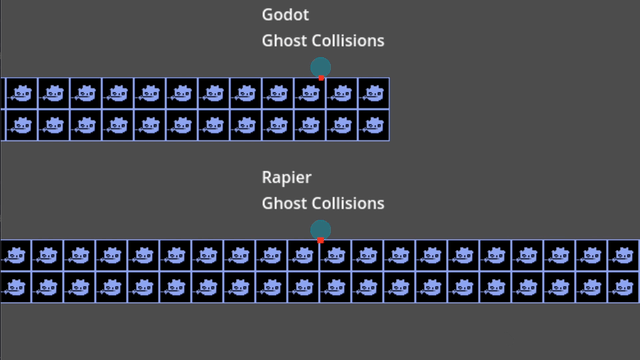

Works on: Desktop, Mobile and Web

        </a>
        

    <strong>
        <a href="https://godot.rapier.rs">Documentation</a> | <a href="https://github.com/appsinacup/godot-rapier-physics/blob/main/CHANGELOG.md">Changelog</a> | <a href="https://discord.gg/56dMud8HYn">Discord</a> | <a href="https://github.com/appsinacup/godot-rapier-physics/blob/main/CONTRIBUTING.md">Contributing</a> | <a href="https://github.com/appsinacup/godot-rapier-physics/blob/main/ARCHITECTURE.md">Architecture</a>
    </strong>

-----

<b>2D and 3D physics engine</b>
<i>for the Godot 4.3 game engine.</i>
with better <b>stability</b>, <b>performance</b>, <b>liquids</b>, <b>determinism</b>, <b>state serialization</b> and <b>no ghost collisions</b>.

-----

Godot Rapier Physics is a **2D and 3D** physics drop-in replacement for the [Godot game engine](https://github.com/godotengine/godot) through [rapier](https://github.com/dimforge/rapier) physics engine [salva](https://github.com/dimforge/salva) fluids simulation library.

# Features

Stability|Ghost Collisions
-|-
|

Fluids 2D| Fluids 3D
-|-
|
**Serialization**|**Deserialization**
Save Physics State|Load Physics State
**Locally Deterministic**|***Optionally Cross Platform Deterministic**
Exact simulation every time (on same platform)|Exact simulation on multiple platforms
# Installation

- Automatic (Recommended): Download the plugin from the official [Godot Asset Store](https://godotengine.org/asset-library/asset/2267) using the `AssetLib` tab in Godot:
    - [Rapier Physics 2D - Fast Version with Parallel SIMD Solver](https://godotengine.org/asset-library/asset/2267)
    - [Rapier Physics 2D - Slower Version with Cross Platform Deterministic](https://godotengine.org/asset-library/asset/2815)
    - [Rapier Physics 3D - Fast Version with Parallel SIMD Solver](https://godotengine.org/asset-library/asset/3084)
    - [Rapier Physics 3D - Slower Version with Cross Platform Deterministic](https://godotengine.org/asset-library/asset/3085)

    Note: For general use cases, use the **Faster Version**.

- Manual: Download the [latest github release](https://github.com/appsinacup/godot-rapier-physics/releases/latest) and move only the `addons` folder into your project `addons` folder.

After installing, go to `Advanced Settings` -> `Physics` -> `2D` or `3D`. Change `Physics Engine` to `Rapier2D` or `Rapier3D`.

# Implementation Progress

This plugin is still being developed. See the [Implementation Progress](https://godot.rapier.rs/docs/progress/) to get an idea of what status it is in and what features it has.

# Limitations

- Pin Softness is not supported
- Double builds are disabled for now (until salva supports double builds)
- No support for asymmetric collisions (eg. object 1 hitting object 2 but object 2 not hitting object 1). This is the exact check rapier does: `(A.layer & B.mask) != 0 || (B.layer & A.mask) != 0`
